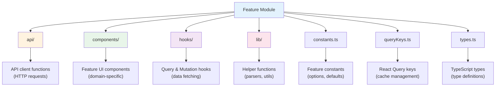
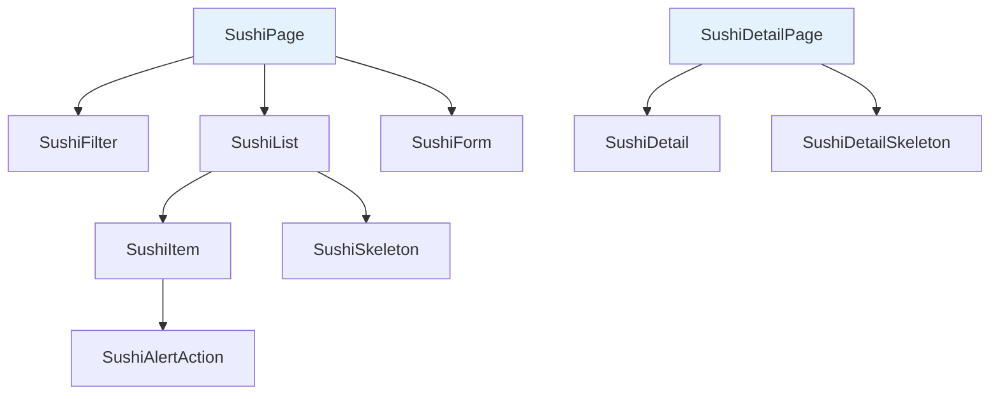
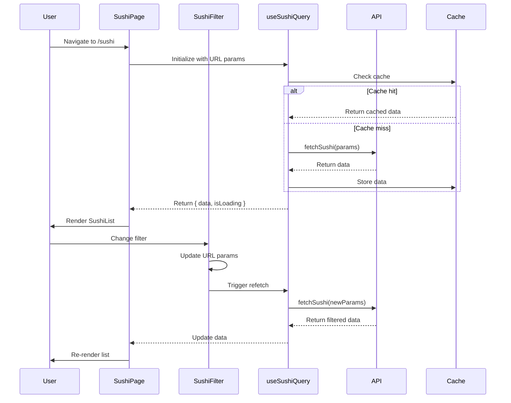
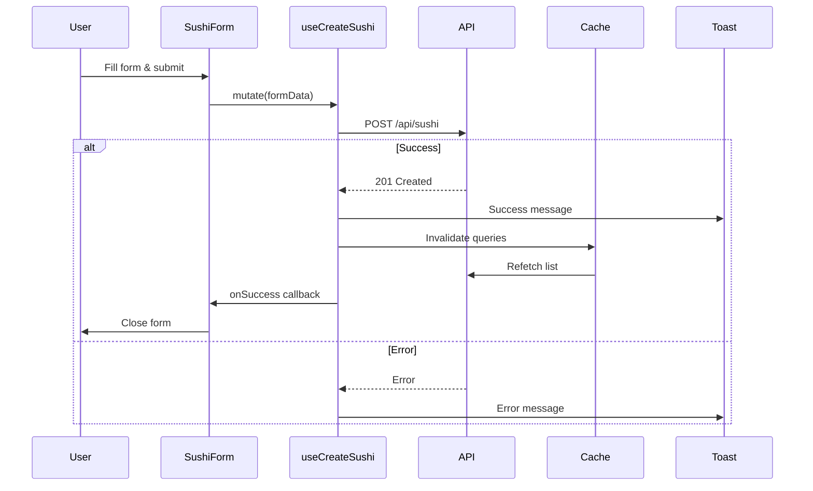

# Features Module Documentation

This document provides detailed documentation of the `src/features/` directory structure and how to work with feature modules.

---

## 📁 Overview

The features directory contains self-contained, domain-specific modules. Each feature encapsulates all related logic including API calls, components, hooks, types, and constants.

```
src/features/
├── sushi/          # Sushi management feature (fully implemented)
└── fish/           # Fish feature (placeholder for future implementation)
```

---

## 🏗️ Feature Module Structure



---

## 🍣 Sushi Feature - Complete Reference

### Directory Structure

```
src/features/sushi/
├── api/
│   └── sushi.ts                    # API client functions for CRUD operations
├── components/
│   ├── SushiAlertAction.tsx        # Confirmation dialog for delete action
│   ├── SushiDetail.tsx             # Detailed view of a single sushi item
│   ├── SushiDetailSkeleton.tsx     # Loading skeleton for detail view
│   ├── SushiFilter.tsx             # Filter controls (search, sort, type)
│   ├── SushiForm.tsx               # Form for creating/editing sushi
│   ├── SushiItem.tsx               # Individual sushi item in list
│   ├── SushiList.tsx               # List view of all sushi items
│   └── SushiSkeleton.tsx           # Loading skeleton for list items
├── hooks/
│   ├── useSushiQuery.ts            # Hook for fetching sushi list with filters
│   ├── useSushiDetailQuery.ts      # Hook for fetching single sushi by ID
│   └── useSushiMutation.ts         # Hooks for create/delete mutations
├── lib/
│   └── filterParsers.ts            # URL query state parsers (nuqs)
├── constants.ts                    # Feature-specific constants
├── queryKeys.ts                    # React Query key factory
└── types.ts                        # TypeScript type definitions
```

---

## 📄 File-by-File Breakdown

### 1. API Layer (`api/sushi.ts`)

**Purpose**: Contains all HTTP request functions for sushi CRUD operations.

**Functions**:

| Function | Parameters | Returns | Description |
|----------|-----------|---------|-------------|
| `fetchSushi` | `params: SushiQueryParams`<br/>`signal: AbortSignal` | `Promise<Sushi[]>` | Fetches filtered/sorted sushi list |
| `createSushi` | `sushi: SushiFormValues` | `Promise<Sushi>` | Creates a new sushi item |
| `fetchSushiById` | `id: string`<br/>`signal: AbortSignal` | `Promise<Sushi>` | Fetches single sushi by ID |
| `deleteSushi` | `id: string` | `Promise<void>` | Deletes sushi by ID |

**Key Patterns**:
- All functions use the centralized `axiosClient`
- Endpoints imported from `@/config/endpoints`
- AbortSignal support for request cancellation
- Type conversion for numeric fields (price)

---

### 2. Components Layer (`components/`)

#### Component Hierarchy



#### Component Details

| Component | Props | Purpose | Key Features |
|-----------|-------|---------|--------------|
| **SushiList** | `sushi: Sushi[]`<br/>`isLoading: boolean` | Renders list of sushi items | Grid layout, empty state, loading skeletons |
| **SushiItem** | `sushi: Sushi` | Individual sushi card | Type-specific display, delete action |
| **SushiFilter** | None (uses URL state) | Filter controls | Search, sort, type filter with URL sync |
| **SushiForm** | `mode?: 'create' \| 'edit'` | Create/edit form | Conditional fields, Zod validation |
| **SushiDetail** | `sushi: Sushi` | Detailed sushi view | Type-specific fields, full information |
| **SushiDetailSkeleton** | None | Loading placeholder | Matches SushiDetail structure |
| **SushiSkeleton** | None | Loading placeholder | Matches SushiItem structure |
| **SushiAlertAction** | `sushiId: string`<br/>`onOpenChange?: (open: boolean) => void` | Delete confirmation | Alert dialog with mutation |

---

### 3. Hooks Layer (`hooks/`)

#### `useSushiQuery.ts`

**Purpose**: Fetches sushi list with URL-synced filters.

**Features**:
- Automatic URL state synchronization via nuqs
- Filters: search, sortBy, type
- React Query integration for caching
- AbortSignal support

**Usage**:
```typescript
const { data, isLoading, error } = useSushiQuery();
```

**URL Params**:
- `?search=salmon` - Filter by name
- `?sortBy=price` - Sort by price or name
- `?type=Roll` - Filter by type (Roll/Nigiri)

---

#### `useSushiDetailQuery.ts`

**Purpose**: Fetches a single sushi item by ID.

**Usage**:
```typescript
const { data, isLoading } = useSushiDetailQuery(id);
```

---

#### `useSushiMutation.ts`

**Purpose**: Contains mutation hooks for create and delete operations.

**Hooks**:

##### `useCreateSushi(options?)`

**Features**:
- Creates new sushi item
- Automatic query invalidation
- Success/error toast notifications
- Optional onSuccess callback

**Usage**:
```typescript
const { mutate, isPending } = useCreateSushi({
  onSuccess: () => console.log('Created!')
});

mutate(formData);
```

##### `useDeleteSushi()`

**Features**:
- Deletes sushi by ID
- Automatic query invalidation
- Success/error toast notifications

**Usage**:
```typescript
const { mutate } = useDeleteSushi();
mutate(sushiId);
```

---

### 4. Library Layer (`lib/filterParsers.ts`)

**Purpose**: Defines URL query parameter parsers for nuqs.

**Parsers**:
- `search`: String parser with default empty string
- `sortBy`: Enum parser for sort options (price/name)
- `type`: Enum parser for type options (all/Roll/Nigiri)

**Integration**: Used by `useSushiQuery` via `useQueryStates(filterParsers)`

---

### 5. Constants (`constants.ts`)

**Purpose**: Feature-specific constants for options, defaults, and labels.

| Constant | Type | Purpose |
|----------|------|---------|
| `SORT_OPTIONS` | Object | Available sort options (price, name) |
| `TYPE_OPTIONS` | Object | Type filter options (all, Roll, Nigiri) |
| `SUSHI_TYPES` | Object | Sushi type constants |
| `FILTER_DEFAULTS` | Object | Default filter values |
| `FORM_DEFAULTS` | Object | Default form values |
| `FORM_PLACEHOLDERS` | Object | Placeholder text for inputs |
| `SUSHI_ITEM_LABELS` | Object | Display labels by type |

**Usage Example**:
```typescript
import { SORT_OPTIONS, FILTER_DEFAULTS } from './constants';
```

---

### 6. Query Keys (`queryKeys.ts`)

**Purpose**: Factory for generating React Query cache keys.

**Structure**:
```typescript
{
  all: () => ["sushi"],
  list: (params?) => ["sushi", "list", params],
  detail: (id) => ["sushi", "detail", id]
}
```

**Benefits**:
- Centralized key management
- Type-safe key generation
- Hierarchical invalidation
- Consistent cache structure

**Usage**:
```typescript
// Invalidate all sushi queries
queryClient.invalidateQueries({ queryKey: queryKeys.all() });

// Invalidate specific list
queryClient.invalidateQueries({ queryKey: queryKeys.list({ sortBy: 'price' }) });
```

---

### 7. Types (`types.ts`)

**Purpose**: TypeScript type definitions for the sushi feature.

#### Core Types

```typescript
// Base type with common fields
type BaseSushi = {
  id: string;
  name: string;
  price: number;
  type: SushiType;
  fishType: string;
  pieces: number;
  createdAt: string;
  fish: string;
  image: string;
}

// Discriminated union for type-specific fields
type Nigiri = {
  type: "Nigiri";
  fishType: string;       // Required
  pieces: number | null;  // Optional
}

type Roll = {
  type: "Roll";
  pieces: number | null;  // Required
  fishType: string | null; // Optional
}

type Sushi = Nigiri | Roll;
```

#### Query Types

```typescript
type SushiQueryParams = {
  sortBy?: SortOption;
  order?: "asc" | "desc";
  search?: string;
  type?: SushiType;
}
```

---

## 🔄 Data Flow Diagram



---

## 🔄 Mutation Flow



---

## 🎯 Feature Responsibilities

### ✅ Feature Module Should:
- Contain all domain-specific logic
- Handle data fetching and mutations
- Manage feature-specific state
- Define types and constants
- Implement business logic

### ❌ Feature Module Should NOT:
- Access other features directly
- Contain global utilities (use `src/lib/` or `src/utils/`)
- Define shared components (use `src/components/`)
- Handle routing (that's in `src/pages/`)

---

## 🔑 Key Patterns

### 1. **Query Key Factory Pattern**
Centralized query key generation prevents cache invalidation bugs:
```typescript
queryKeys.all()        // ["sushi"]
queryKeys.list()       // ["sushi", "list", undefined]
queryKeys.detail("1")  // ["sushi", "detail", "1"]
```

### 2. **URL State Sync Pattern**
Filters automatically sync with URL for:
- Shareable links
- Browser back/forward navigation
- Persistent state across page refreshes

### 3. **Optimistic UI Updates**
Mutations invalidate queries, triggering automatic refetch for fresh data.

### 4. **Type-Safe API Layer**
All API functions are typed with request/response types from `types.ts`.

### 5. **Conditional Form Fields**
Form adapts based on sushi type (Roll vs Nigiri) using discriminated unions.

---

## 🧪 Testing Considerations

When testing feature modules:

1. **API Layer**: Mock axios, test request parameters
2. **Hooks**: Use `@testing-library/react-hooks` or Vitest
3. **Components**: Test rendering, user interactions, loading states
4. **Query Keys**: Ensure correct invalidation logic
5. **Type Guards**: Test discriminated union type safety

---

## 📚 Related Documentation

- [Components Documentation →](COMPONENTS.md)
- [How to Add a Feature →](HOW_TO_ADD_FEATURE.md)
- [Core Libraries →](CORE_LIBRARIES.md)
- [Architecture Decisions →](ARCHITECTURE_DECISIONS.md)

---

## 🎓 Learning Resources

To understand the technologies used in features:

- **React Query**: [TanStack Query Docs](https://tanstack.com/query/latest)
- **Nuqs**: [URL State Management](https://nuqs.47ng.com/)
- **Zod**: [Schema Validation](https://zod.dev/)
- **TypeScript Discriminated Unions**: [TS Handbook](https://www.typescriptlang.org/docs/handbook/unions-and-intersections.html#discriminating-unions)
