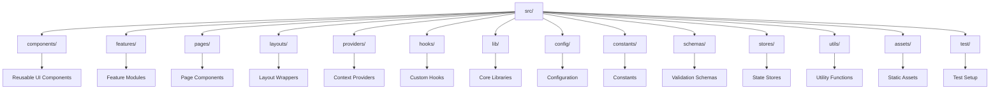
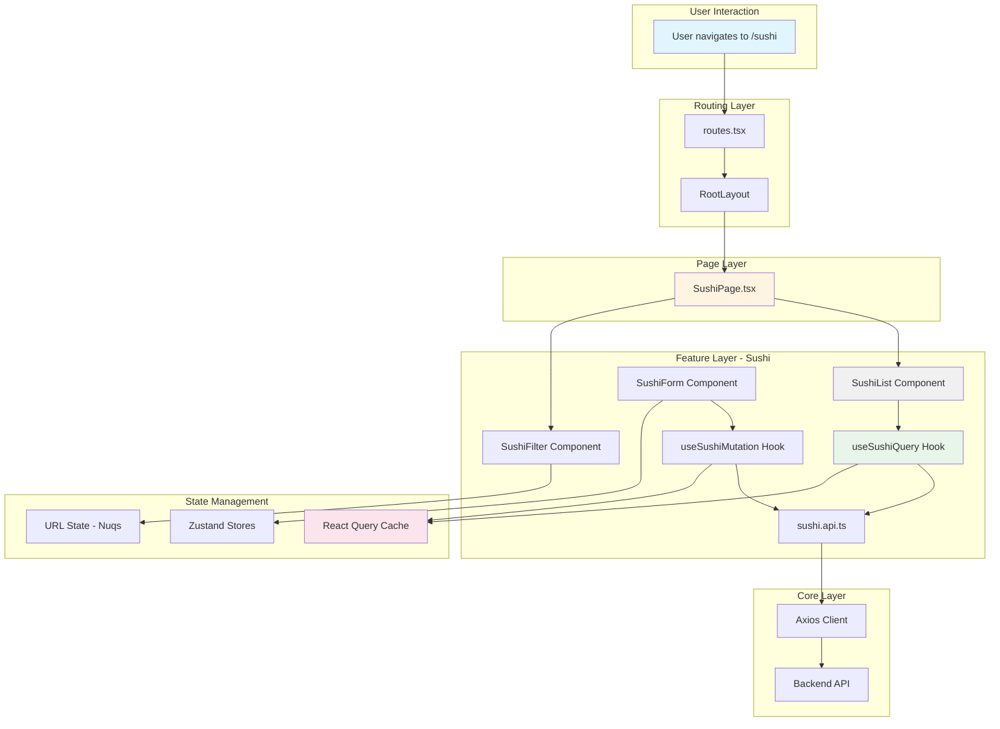
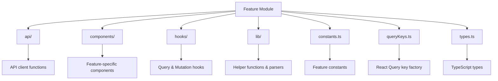

# Project Structure Documentation

Welcome to the project! This document provides a comprehensive overview of the codebase structure to help new developers get up to speed quickly.

## 📚 Documentation Index

- **[PROJECT_STRUCTURE.md](PROJECT_STRUCTURE.md)** (this file) - High-level overview and folder structure
- **[FEATURES.md](FEATURES.md)** - Detailed documentation of the features module
- **[COMPONENTS.md](COMPONENTS.md)** - UI components and commons documentation
- **[CORE_LIBRARIES.md](CORE_LIBRARIES.md)** - Core utilities, providers, and configuration
- **[HOW_TO_ADD_FEATURE.md](HOW_TO_ADD_FEATURE.md)** - Step-by-step guide for adding new features
- **[ARCHITECTURE_DECISIONS.md](ARCHITECTURE_DECISIONS.md)** - Architecture decision records and rationale

---

## 🏗️ Architecture Overview

This application follows a **Feature-Based Modular Architecture** pattern with clear separation of concerns. Each feature is self-contained with its own components, hooks, API layer, and types.

### Technology Stack

- **React 18** - UI library
- **TypeScript** - Type safety
- **React Router** - Client-side routing
- **TanStack Query (React Query)** - Server state management
- **Zustand** - Global UI state management
- **Nuqs** - URL state synchronization
- **Axios** - HTTP client
- **Zod** - Schema validation
- **Shadcn UI** - Component library
- **Tailwind CSS** - Styling
- **Vitest** - Testing framework

---

## 📁 First-Level Folder Structure



---

## 📂 Detailed Structure

### Root Files

```
src/
├── App.tsx              # Main application component with routing setup
├── App.css              # Global application styles
├── main.tsx             # React DOM entry point
└── routes.tsx           # Route configuration with React Router
```

### Directory Overview

| Directory | Purpose | Details |
|-----------|---------|---------|
| **[components/](COMPONENTS.md)** | Reusable UI components | Contains `commons/` for layout components and `ui/` for Shadcn components |
| **[features/](FEATURES.md)** | Feature modules | Self-contained domain-specific features (e.g., sushi, fish) |
| **[pages/](CORE_LIBRARIES.md#pages)** | Page components | Top-level route components with minimal logic |
| **[layouts/](CORE_LIBRARIES.md#layouts)** | Layout wrappers | Layout components for consistent page structure |
| **[providers/](CORE_LIBRARIES.md#providers)** | Context providers | Global providers (Error Boundary, React Query, etc.) |
| **[hooks/](CORE_LIBRARIES.md#hooks)** | Global hooks | Shared custom hooks (not feature-specific) |
| **[lib/](CORE_LIBRARIES.md#lib)** | Core libraries | HTTP client, query client, utility functions |
| **[config/](CORE_LIBRARIES.md#config)** | Configuration | API endpoints, environment variables, app config |
| **[constants/](CORE_LIBRARIES.md#constants)** | Constants | Routes, messages, common values |
| **[schemas/](CORE_LIBRARIES.md#schemas)** | Validation schemas | Zod schemas for form validation |
| **[stores/](CORE_LIBRARIES.md#stores)** | State stores | Zustand stores for global UI state |
| **[utils/](CORE_LIBRARIES.md#utils)** | Utilities | General-purpose utility functions |
| **[assets/](CORE_LIBRARIES.md#assets)** | Static assets | Images, SVGs, fonts |
| **[test/](CORE_LIBRARIES.md#test)** | Test setup | Testing configuration and utilities |

---

## 🔄 Data Flow Architecture



---

## 🧩 Feature Module Pattern

Each feature in `src/features/` follows this consistent structure:



**Benefits:**
- **Encapsulation**: All feature logic in one place
- **Scalability**: Easy to add new features
- **Maintainability**: Clear separation of concerns
- **Testability**: Isolated, testable units

---

## 🎯 Layer Responsibilities

### 1. **Page Layer** (`src/pages/`)
- Route handlers with minimal logic
- Compose feature components
- Handle page-level state if needed

### 2. **Feature Layer** (`src/features/`)
- Business logic and domain-specific components
- Data fetching and mutations
- Feature-specific state management

### 3. **Component Layer** (`src/components/`)
- Reusable, presentational components
- No business logic
- Highly composable

### 4. **Core Layer** (`src/lib/`, `src/config/`, `src/providers/`)
- Infrastructure and configuration
- Global utilities
- Provider setup

---

## 🚀 Quick Start for New Developers

1. **Read the Architecture Decisions**: Start with [ARCHITECTURE_DECISIONS.md](ARCHITECTURE_DECISIONS.md) to understand why things are structured this way

2. **Explore a Feature**: Look at `src/features/sushi/` as a reference implementation - see [FEATURES.md](FEATURES.md)

3. **Understand Components**: Review the component library - see [COMPONENTS.md](COMPONENTS.md)

4. **Add a New Feature**: Follow the step-by-step guide - see [HOW_TO_ADD_FEATURE.md](HOW_TO_ADD_FEATURE.md)

5. **Review Core Libraries**: Understand the foundational utilities - see [CORE_LIBRARIES.md](CORE_LIBRARIES.md)

---

## 📝 Common Patterns

### Error Handling
- Error boundaries wrap all feature routes
- Global error fallback component
- Error states in components
- Toast notifications for user feedback

### State Management
- **Server State**: React Query (data fetching, caching, synchronization)
- **Global UI State**: Zustand (dialogs, sheets, modals)
- **URL State**: Nuqs (filters, pagination, search)
- **Form State**: React Hook Form with Zod validation

### Code Organization
- One component per file
- Co-locate related files (components, hooks, types)
- Barrel exports for cleaner imports
- Consistent naming: `ComponentName.tsx`, `useHookName.ts`

---

## 🔍 Finding Things

- **Routes**: Check `src/routes.tsx` and `src/constants/routes.ts`
- **API Endpoints**: See `src/config/endpoints.ts`
- **Types**: Look in feature's `types.ts` or component props
- **Constants**: Check `src/constants/` or feature's `constants.ts`
- **Utilities**: Search in `src/utils/` or `src/lib/utils.ts`

---

## 📖 Next Steps

- [Explore the Features module →](FEATURES.md)
- [Learn about Components →](COMPONENTS.md)
- [Understand Core Libraries →](CORE_LIBRARIES.md)
- [Add your first feature →](HOW_TO_ADD_FEATURE.md)
- [Review Architecture Decisions →](ARCHITECTURE_DECISIONS.md)
